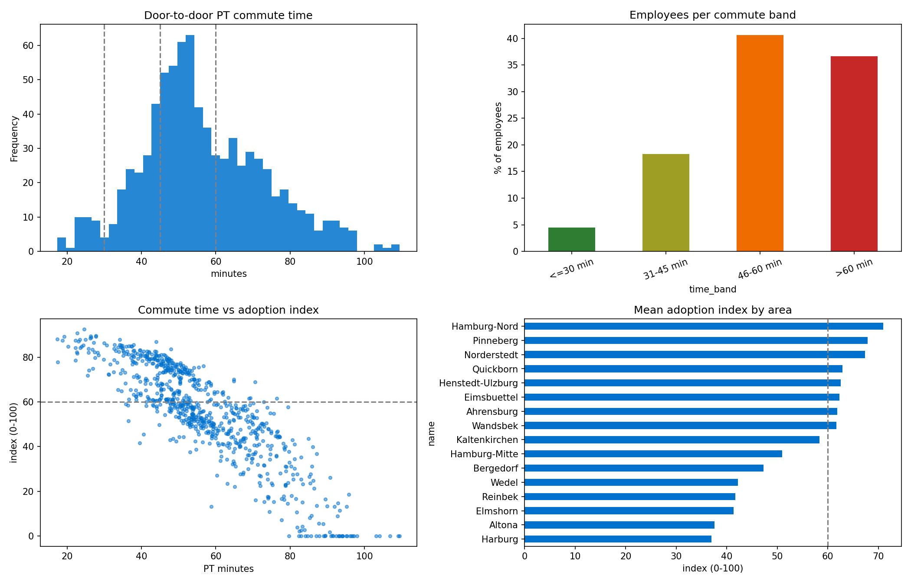

# Deutschlandticket commute analysis

Data science assessment for Johnson & Johnson Medical GmbH, Norderstedt.

**Question:** How attractive would public transport and the Deutschlandticket be for employees
commuting to Robert-Koch-Str. 1, 22851 Norderstedt?

**Author:** Danish Mahmood Ali · [GitHub](https://github.com/danishmahmoodali) · [Portfolio](https://danishmahmoodali.github.io/Portfolio)

## What this does

The analysis builds a synthetic workforce of 800 employees (no real employee data), places their
homes across Hamburg's districts and the surrounding HVV towns in proportion to population, and
routes each of them to the office on the real HVV GTFS timetable. Routing runs on a graph built
from the schedule itself: ride edges between consecutive stops, walking transfers between stops
within 250 m, and one Dijkstra pass from the stop nearest the office. A door-to-door trip is the
walk to the stop, the wait, the ride with any transfers, and the walk at the other end. A simple
distance-based car time serves as the benchmark.

Each employee then gets an adoption score from 0 to 100. Everyone starts at 100 and loses points
for friction: minutes slower than driving, commute length past 45 minutes, transfers, walking, and
thin service. The penalties come from judgement informed by mode-choice literature, not from fitted
coefficients, since no real adoption data exists. The notebook documents each one and tests how
much the results move when they change. Area rankings barely move (Spearman 0.83 across very
different weightings).

## Headline results

| Metric | Value |
|---|---|
| Employees within 30 min by PT | 4.5% |
| Within 45 min | 22.8% |
| Within 60 min | 63.4% |
| Over 60 min or no viable PT | 36.6% |
| Median PT commute | 54 min (car: 30 min) |
| Mean adoption index | 55 / 100 |
| Likely adopters (index >= 60) | 44.2% |

Best connected to the site: Norderstedt, Hamburg-Nord, Wandsbek, Henstedt-Ulzburg.
Weakest: Reinbek, Harburg, Elmshorn, Wedel.

Highest adoption potential: Hamburg-Nord, Pinneberg, Norderstedt, Quickborn.
Lowest: Reinbek, Elmshorn, Altona, Harburg.

One result worth pausing on: Norderstedt has the best commute (median 30.5 min, no transfers)
but ranks third on adoption, not first. Its car times are so short (median 8 min) that even a
cheap ticket competes badly with just driving. Living close to work is the one thing the
Deutschlandticket cannot beat.



The interactive map (`outputs/commute_map.html`) shows every synthetic employee coloured by
commute band, plus a heat layer of likely adopters. Open it in a browser.

## How to run

On Google Colab: upload `Assessment.ipynb`, run all cells. The notebook downloads the GTFS feed
itself if it is not already present.

Locally:

```bash
python -m venv .venv
source .venv/bin/activate        # Windows: .venv\Scripts\activate
pip install -r requirements.txt
```

Open the notebook in VS Code or Jupyter, select the `.venv` kernel, run all cells. A pinned copy
of the GTFS feed sits in `data/`, so a rerun reproduces the committed numbers exactly. Delete it
and the notebook fetches the current feed instead, in which case travel times and scores will
shift a little because the schedule is newer.

Note on paths: a rerun writes the CSVs and map into `data/` and the chart into `outputs/`. The
committed result files are collected under `outputs/` for convenience.

## Repository contents

```
Assessment.ipynb          the full analysis, commented and sectioned
data/hvv_gtfs.zip         HVV GTFS timetable (open data, Hamburg Transparenzportal)
outputs/                  results from the committed run:
  employee_results.csv      per-employee times, transfers, scores
  area_summary.csv          per-area medians and adoption ranking
  commute_map.html          interactive Folium map
  summary_charts.png        the four summary charts
requirements.txt
```

## Limitations

Employee homes are synthetic, sampled by district population, so they approximate the commuter
belt rather than reproduce it. Routing uses a timetable graph rather than a full engine like R5,
which means minimum scheduled segment times and a half-headway wait estimate; absolute times are
indicative while comparisons between areas are solid. Car times ignore congestion, which flatters
driving and makes the PT numbers conservative. The scoring penalties rest on judgement and are
sensitivity-tested rather than estimated from data. The GTFS feed is dated December 2024.

## Data source

HVV timetable data from the [Hamburg Transparenzportal](https://suche.transparenz.hamburg.de)
(open data). Workplace coordinates geocoded with Nominatim/OpenStreetMap.
